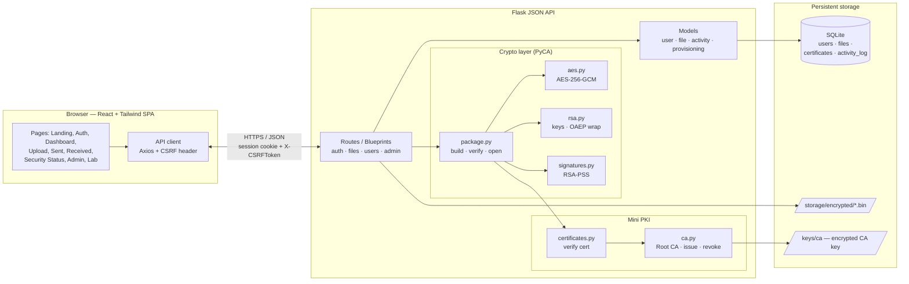
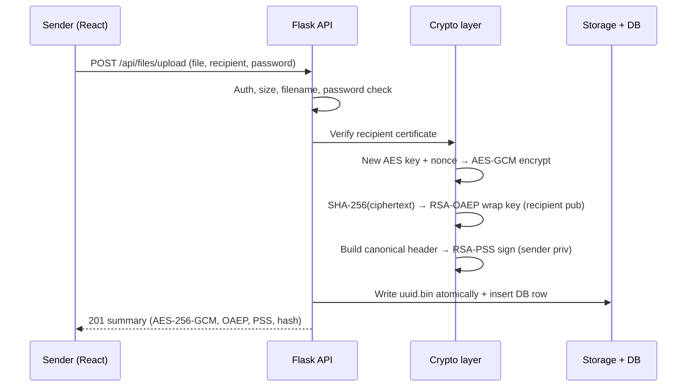
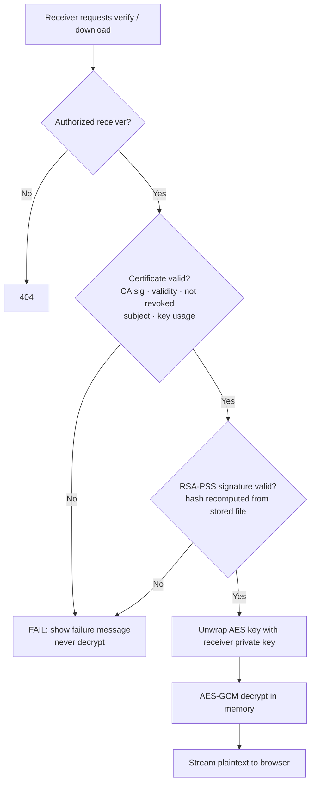
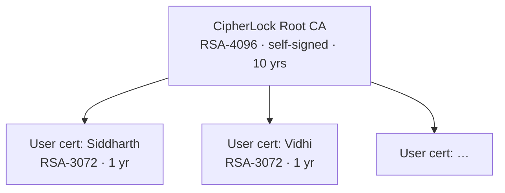

# CipherLock — Master Project Document

**Secure File Storage and Sharing System** · Cryptography and Network Security · SPIT Mumbai

> This is the single source of truth for the project. It condenses the 10-phase build prompts and adapts them to the final target: a **proper React + Tailwind CSS frontend** talking to a **fully working Flask JSON-API backend**. All cryptographic design decisions (D1–D8) are unchanged from the original prompts.

> **Current repository state / deviations note (Phase 2):**
> 1. **Repository Layout:** The backend code lives directly at the repository root (`app.py`, `models/`, `routes/`, `database/`, `tests/`) rather than nested in a `backend/` directory. All paths map 1-to-1 (`backend/models/user.py` $\rightarrow$ `models/user.py`).
> 2. **Frontend Architecture:** The authenticated SPA lives in `frontend/` (React 18 + Vite + Tailwind v3). The public home page (`/`) is currently served by Flask via Phase 1's Jinja2 template and links seamlessly to the SPA via `FRONTEND_URL` (`/login`, `/register`, `/dashboard`). Vite proxies `/api` to Flask in dev; Phase 10 will serve `frontend/dist` directly from Flask for production single-origin hosting.
> 3. **Health Check:** Root health endpoint is `GET /health` $\rightarrow$ `{"status": "ok"}`.

---

## 1. Project Overview

CipherLock is a working web application that lets one registered user send a file to another so that:

- **only the recipient can read it** (confidentiality),
- **the recipient can prove who sent it** (sender authentication),
- **any tampering is detected and the file is never decrypted** (integrity, fail-closed).

It is real, runnable code, not a simulation. It includes its own mini Public Key Infrastructure (a Root CA that issues X.509 certificates to users).

**Security goals**

| Goal | Mechanism |
|---|---|
| Confidentiality | AES-256-GCM |
| Integrity / tamper detection | RSA-PSS signature + GCM tag |
| Sender authentication | X.509 certificate + signature |
| Secure key management | Random session key wrapped with RSA-OAEP |
| Trust | Mini CA (Root CA → user certificates) |
| Authorization | Only the intended recipient gets the file |

**End product**

- **Frontend:** React single-page app (Vite + Tailwind CSS) — landing, register, login, dashboard, upload pipeline, sent/received lists, security-status screen, certificate directory, admin panel, attack lab.
- **Backend:** Flask REST API (JSON), SQLite, PyCA `cryptography`, session-cookie auth with CSRF protection.

---

## 2. Tech Stack

| Layer | Technology |
|---|---|
| Frontend framework | React 18 + Vite |
| Styling | Tailwind CSS (dark-blue professional theme) |
| Frontend routing / HTTP | React Router, Axios (or fetch) with `withCredentials` |
| Frontend extras | lucide-react (icons), react-hot-toast (notifications) |
| Backend | Python 3.11+, Flask (JSON API only, no Jinja pages) |
| Cryptography | PyCA `cryptography` (AES-GCM, RSA-OAEP, RSA-PSS, X.509) |
| Database | `sqlite3` (standard library, no ORM, parameterized queries) |
| Password hashing | Werkzeug (scrypt) |
| CSRF | Flask-WTF `CSRFProtect` (token fetched from `/api/csrf-token`, sent as `X-CSRFToken` header) |
| Config | python-dotenv |
| Testing | pytest + coverage (backend), optional Vitest (frontend) |

**Fixed design decisions (never change)**

- **D1** Hybrid encryption: AES-256-GCM encrypts the file; RSA-OAEP (SHA-256, MGF1-SHA-256) wraps the AES key; RSA-PSS (SHA-256, salt 32) signs. RSA never encrypts the file. No ECDSA for encryption, no custom algorithms, no hardcoded keys.
- **D2** One RSA-3072 key pair per user. X.509 KeyUsage = digitalSignature + keyEncipherment (simplification).
- **D3** Private key stored only as encrypted PKCS#8 PEM (passphrase = user's password). Password stored separately as a salted scrypt hash. The key is unlocked only inside a single request (user re-enters password); never kept in session, logs, HTML or API responses.
- **D4** Root CA: RSA-4096, self-signed, 10 years, CA key encrypted with passphrase from `CIPHERLOCK_CA_PASSPHRASE`. User certs: 1 year, unique serial, CN=name + emailAddress=email, status tracked in DB.
- **D5** New 32-byte AES key and new random 12-byte nonce for every file. Stored data = ciphertext‖16-byte tag. AAD = canonical header bytes.
- **D6** Canonical signed header (JSON, sorted keys, no spaces, UTF-8): `{version, sender_id, receiver_id, original_filename, nonce_b64, wrapped_key_b64, ciphertext_sha256_hex, sender_cert_serial}`. Ciphertext hash is **recomputed** at verification, never trusted from the DB.
- **D7** Receiver pipeline (fail closed): authorization → certificate check → signature verify → **only then** unwrap key → AES-GCM decrypt in memory. On failure: *"Signature verification failed. File may have been modified or sender authenticity could not be established."*
- **D8** Max 25 MB, `secure_filename`, stored as `<uuid4>.bin` in `storage/encrypted/`, plaintext never written to disk.

---

## 3. Architecture Diagram

### 3.1 System architecture



### 3.2 Send flow (upload)



### 3.3 Receive flow (verify and decrypt, fail closed)



### 3.4 Certificate trust chain



---

## 4. Project Folder Structure

Monorepo with a clean split: `backend/` (Flask API) and `frontend/` (React SPA).

```text
CipherLock/
├── CipherLock.md                  # this master document
├── README.md
├── .gitignore                     # .env, keys/, storage/, certificates/, *.db, venv, node_modules, dist
│
├── backend/
│   ├── app.py                     # create_app(), CSRFProtect, blueprints, error handlers, /api/health
│   ├── config.py                  # env loading, paths, 25 MB limit, cookie settings
│   ├── init_db.py                 # creates all 4 tables
│   ├── requirements.txt
│   ├── .env.example               # SECRET_KEY, CIPHERLOCK_CA_PASSPHRASE, DEMO_MODE=0
│   ├── database/                  # cipherlock.db
│   ├── routes/
│   │   ├── __init__.py            # login_required, admin_required
│   │   ├── auth.py                # register, login, logout, me, csrf-token
│   │   ├── files.py               # upload, sent, received, verify, download
│   │   ├── users.py               # directory, certificate download/view
│   │   └── admin.py               # CA info, users, certs, revoke, logs, attack lab
│   ├── crypto/
│   │   ├── aes.py                 # AES-256-GCM
│   │   ├── rsa.py                 # keygen, encrypted PEM, OAEP wrap/unwrap
│   │   ├── signatures.py          # RSA-PSS sign/verify
│   │   ├── ca.py                  # Root CA, issue, revoke
│   │   ├── certificates.py        # certificate verification (CertReport)
│   │   └── package.py             # build / verify / open (SecurityReport)
│   ├── models/
│   │   ├── user.py
│   │   ├── file.py                # authorization lives here
│   │   ├── activity.py
│   │   └── provisioning.py        # keys + certificate at registration
│   ├── storage/
│   │   ├── encrypted/             # <uuid4>.bin
│   │   └── backup/                # attack-lab backups
│   ├── certificates/{ca,users}/
│   ├── keys/ca/                   # encrypted CA key
│   ├── scripts/                   # check_env, init_ca, create_admin, demo_aes, demo_wrap_sign,
│   │                              # e2e_cli, demo_tamper, demo_unauthorized, demo_revocation,
│   │                              # audit_secrets, run_all_checks
│   └── tests/                     # test_app, test_auth, test_aes, test_rsa_keys, test_ca_certs,
│                                  # test_wrap, test_signatures, test_package, test_upload,
│                                  # test_flow, test_attacks
│
├── frontend/
│   ├── package.json
│   ├── vite.config.js             # dev proxy: /api → http://127.0.0.1:5000
│   ├── tailwind.config.js
│   ├── postcss.config.js
│   ├── index.html
│   └── src/
│       ├── main.jsx
│       ├── App.jsx                # router + layout
│       ├── index.css              # Tailwind directives + theme
│       ├── api/
│       │   └── client.js          # axios instance, CSRF handling, error mapping
│       ├── context/
│       │   └── AuthContext.jsx    # current user, login/logout, route guards
│       ├── components/
│       │   ├── Navbar.jsx
│       │   ├── ProtectedRoute.jsx # login / admin guards
│       │   ├── StatusBadge.jsx
│       │   ├── SecurityPanel.jsx  # Certificate / Signature / Integrity panels
│       │   ├── SecurityBox.jsx    # monospace CIPHERLOCK SECURITY CHECK box
│       │   ├── PipelineSteps.jsx  # Encrypt → Wrap → Sign → Store
│       │   ├── PasswordPrompt.jsx
│       │   └── Spinner.jsx
│       └── pages/
│           ├── Landing.jsx
│           ├── Register.jsx
│           ├── Login.jsx
│           ├── Dashboard.jsx
│           ├── Upload.jsx
│           ├── SentFiles.jsx
│           ├── ReceivedFiles.jsx
│           ├── SecurityStatus.jsx
│           ├── Directory.jsx      # users + certificates
│           ├── CertificateView.jsx
│           ├── NotFound.jsx
│           └── admin/
│               ├── AdminPanel.jsx # users, certs, CA info, activity log
│               ├── AttackLab.jsx  # DEMO_MODE only
│               └── StolenData.jsx
│
└── docs/
    ├── architecture.md            # Mermaid diagrams
    ├── security_checklist.md      # 20 requirements → file/function → test
    ├── test_report.md
    ├── report_outline.md
    ├── presentation_outline.md
    ├── screenshots_checklist.md
    ├── demo_script.md
    └── viva_qa.md
```

**Database (SQLite, 4 tables)**

- `users(id, name, email UNIQUE, password_hash, public_key, encrypted_private_key, certificate, is_admin, is_active, created_at)`
- `files(id, sender_id, receiver_id, original_filename, encrypted_filename, encrypted_session_key, nonce, signature, sender_certificate, ciphertext_sha256, status, created_at)`
- `certificates(id, user_id, certificate, serial_number, issued_at, expires_at, status)`
- `activity_log(id, user_id, action, detail, created_at)`

**Core API surface (JSON)**

| Method | Endpoint | Purpose |
|---|---|---|
| GET | `/api/health` | Health check |
| GET | `/api/csrf-token` | Fetch CSRF token for the SPA |
| POST | `/api/auth/register` · `/login` · `/logout` | Account lifecycle |
| GET | `/api/auth/me` | Current session user |
| GET | `/api/dashboard` | Counts, recent activity, own cert status |
| GET | `/api/users/directory` | Active users + cert info (recipients) |
| GET | `/api/users/<id>/certificate` · `/view` | Public cert PEM / decoded fields |
| POST | `/api/files/upload` | Encrypt, wrap, sign, store |
| GET | `/api/files/sent` · `/received` | Lists |
| GET | `/api/files/<id>/verify` | Run verification, return report |
| POST | `/api/files/<id>/download` | Re-verify, decrypt, stream bytes |
| GET/POST | `/api/admin/*` | CA info, users, certs, revoke, re-issue, logs |
| POST | `/api/admin/lab/*` | Attack simulation (admin + `DEMO_MODE=1` only) |

---

## 5. The 10 Phases (in brief)

> Do the phases in order. After each phase, run its tests before moving on. Frontend work is built alongside the backend of each phase so every phase ends with something you can click.

### Phase 1 — Foundation
**Goal:** runnable skeleton with API, DB schema and a frontend shell.

- Backend: `config.py` (env, secret key fallback, paths, 25 MB limit, HttpOnly + SameSite=Lax cookies, 30-min sessions), `create_app()` with CSRFProtect, empty blueprints, `/api/health`, JSON error handlers (403, 404, 413), auto-create folders, `init_db.py` creating all four tables with FKs and indexes, `scripts/check_env.py`.
- Frontend: Vite + React + Tailwind scaffold, dev proxy to Flask, router, Navbar (changes by login state), Landing page with 6 feature cards (AES-256-GCM, RSA-OAEP, RSA-PSS, X.509 + mini CA, tamper detection, secure sharing), 404 page, dark-blue theme.
- **Test:** `check_env`, `init_db`, `pytest tests/test_app.py`, open the SPA, hit `/api/health`, confirm 4 tables in sqlite3.

### Phase 2 — Authentication
**Goal:** registration, login, logout, sessions, activity log.

- Backend: parameterized `models/user.py`, `log_activity` (never logs secrets), `/api/auth/*`. Password policy (≥10 chars, upper, lower, digit), scrypt hashing, generic "Invalid email or password", 5 failures per email+IP → 5-minute lockout, session re-created on login (stores only `user_id`), `login_required` / `admin_required`, `provision_user_crypto()` placeholder hook.
- Frontend: `AuthContext`, `ProtectedRoute`, `api/client.js` (CSRF token handling), Register and Login forms with validation and password-strength meter, Dashboard placeholder.
- **Test:** `tests/test_auth.py` (duplicate email, weak password, wrong password, lockout, `scrypt:` hash); register Siddharth and Vidhi in the UI.

### Phase 3 — Crypto Core: AES-256-GCM and RSA key pairs
**Goal:** independent, tested AES module and RSA key generation with encrypted private keys.

- `crypto/aes.py`: 256-bit key, fresh 12-byte nonce per call, `DecryptionError` on invalid tag.
- `crypto/rsa.py` (part 1): RSA-3072 keygen, encrypted PKCS#8 PEM (BestAvailableEncryption), load with passphrase, public PEM, SHA-256 fingerprint.
- `provision_user_crypto()` now generates keys at registration (frontend shows a "Generating your keys…" spinner).
- `scripts/demo_aes.py`; tests for round trip, 1-byte flip, wrong key / AAD, 1,000 distinct nonces, PEM headers.
- **Test:** `pytest`; confirm `users.encrypted_private_key` starts with `BEGIN ENCRYPTED PRIVATE KEY`.

### Phase 4 — Mini CA and X.509 Certificates
**Goal:** trust infrastructure and certificate management UI.

- `crypto/ca.py`: RSA-4096 self-signed Root CA (passphrase from env, refuses to run without it, file mode 0600), `issue_user_certificate()` (365 days, unique serial, CN + email, SAN, KeyUsage, AKI/SKI), `revoke_certificate()`.
- `crypto/certificates.py`: `verify_certificate()` → `CertReport` (CA signature, validity, not revoked, subject email, key usage).
- `scripts/init_ca.py`, `scripts/create_admin.py`; provisioning now issues and stores the certificate.
- API + UI: certificate directory, certificate download and decoded view, first version of the admin panel (CA info, certificate table, revoke).
- **Test:** `tests/test_ca_certs.py` (rogue CA, expired, revoked, wrong email, tampered DER); `openssl verify` returns OK.

### Phase 5 — RSA-OAEP Key Wrapping and RSA-PSS Signatures
**Goal:** finish `rsa.py` and add `signatures.py`, each fully unit-tested.

- `wrap_session_key` / `unwrap_session_key` (OAEP SHA-256 / MGF1-SHA-256, `UnwrapError`), 32-byte key validation.
- `sign_data` / `verify_signature` (PSS, salt 32, returns True/False), `sha256_hex`.
- `scripts/demo_wrap_sign.py`: wrapped length 384 bytes, randomized OAEP/PSS, wrong-key failures, bit-flip detection.
- Explain the OAEP size formula (384 − 64 − 2 = 318 bytes max) and why OAEP/PSS beat PKCS#1 v1.5.
- **Test:** `test_wrap.py`, `test_signatures.py`, demo script output.

### Phase 6 — Hybrid Secure Package (CLI proof)
**Goal:** `crypto/package.py` joins everything; prove the whole flow and all attacks without the UI.

- `canonical_header()` per D6; `build_package()` (AES key → AAD → encrypt → hash → wrap → header → sign); `verify_package()` → `SecurityReport` (certificate, signature, integrity, overall, messages); `open_package()` refuses unless TRUSTED; `format_security_box()`.
- `scripts/e2e_cli.py` runs the happy path plus 9 attacks: ciphertext byte flip, filename change, receiver change, foreign signature, rogue-CA cert, expired cert, revoked cert, wrong private key, attacker with everything except the private key.
- **Test:** `test_package.py` (all 9 cases + 5 MB file), `e2e_cli.py` PASS/FAIL table.

### Phase 7 — Secure Upload, Storage and Sharing
**Goal:** the sender side, end to end, in the real UI.

- Backend: `models/file.py` (authorization at the query level, non-owners get 404), `POST /api/files/upload` (checks: auth, non-empty, ≤25 MB, `secure_filename`, recipient's certificate valid *before* wrapping, password check, key loads) → `build_package` → atomic write of `<uuid4>.bin` (0600) → DB row `pending_verification` → activity log. `GET /api/files/sent`, dashboard stats.
- Frontend: **Upload page** (file picker with name/size preview, recipient dropdown, password prompt, animated pipeline Encrypt → Wrap key → Sign → Store, success summary with ciphertext SHA-256), **Sent Files page** (no decrypt option), dashboard counts and cert status.
- **Test:** `test_upload.py` (no plaintext in `.bin`, wrong password stores nothing, revoked recipient rejected, third user sees nothing); inspect the `.bin` in a hex viewer.

### Phase 8 — Receiver Workflow, Security Status and Decryption
**Goal:** verified decryption with a clear security-status screen.

- Backend: `GET /api/files/received`, `GET /api/files/<id>/verify` (recomputes everything, saves `verified`/`failed`), `POST /api/files/<id>/download` (re-verifies every time; only if TRUSTED unlocks the key with the entered password, calls `open_package`, streams from memory with `Cache-Control: no-store`). Separate safe messages for `TamperError`, `UnwrapError`, `DecryptionError`.
- Frontend: **Received Files page** (status badges, Verify / Decrypt buttons), **Security Status page** with three large panels (CERTIFICATE / SIGNATURE / INTEGRITY, green/red), per-check ticks and crosses, the monospace `CIPHERLOCK SECURITY CHECK` box, sender details, and a Decrypt & Download form shown only when TRUSTED (blob download via the API client).
- **Test:** `test_flow.py` (A→B identical bytes, C gets 404, wrong password refused, tampered `.bin` refused with the exact failure message, sender cannot download); compare SHA-256 of original and downloaded file.

### Phase 9 — Attack Demonstrations and Admin Completion
**Goal:** show the defenses working, and finish the admin experience.

- **Attacker Simulation Lab** (admin + `DEMO_MODE=1` only, otherwise 404): tamper ciphertext, tamper metadata, random signature, rogue-CA certificate swap, restore original; each action logged as `SIMULATED ATTACK` with a link to the red security-status result.
- **Stolen-data page:** shows what an attacker holds and tries (a) an attacker RSA key, (b) a random 256-bit key, (c) the sender's public key — all fail; explains 2^256 infeasibility.
- CLI demos: `demo_tamper.py`, `demo_unauthorized.py` (7 cases), `demo_revocation.py` (+ expiry).
- Admin completion: enable/disable users, certificate filters (active/revoked/expired), revoke, re-issue (requires the user's password), CA info, searchable activity log. Never shows private keys, hashes or key blobs.
- **Test:** `test_attacks.py`; run every demo script; capture screenshots.

### Phase 10 — Hardening, Testing, Documentation and Viva
**Goal:** production-style polish and everything needed for submission and demo.

- **Hardening:** security headers (CSP restricted to self, `nosniff`, `X-Frame-Options: DENY`, `Referrer-Policy: no-referrer`, `no-store` on authenticated responses), rate limits on login/upload/download, switchable Secure cookie flag, `scripts/audit_secrets.py`, optional local HTTPS (TLS protects the connection, CipherLock protects stored and shared files). Serve the built React app from Flask for single-origin deployment.
- **Testing:** `scripts/run_all_checks.py` (audit + pytest with coverage + CLI demos → single PASS/FAIL), `docs/security_checklist.md` (20 requirements → file/function → test), `docs/test_report.md`.
- **Documentation:** `README.md` (setup for PowerShell and macOS/Linux, backend + frontend), `docs/architecture.md` (6 Mermaid diagrams), `report_outline.md`, `presentation_outline.md` (~15 slides), `screenshots_checklist.md`, `demo_script.md` (DEMO 1–13), `viva_qa.md` (25+ Q&A).
- **Test:** `python scripts/run_all_checks.py` finishes with an all-PASS summary.

---

## 6. Quick Run Reference (final system)

**Backend**

```bash
# macOS / Linux
cd backend
python3 -m venv venv && source venv/bin/activate
pip install -r requirements.txt
cp .env.example .env            # set SECRET_KEY and CIPHERLOCK_CA_PASSPHRASE
python init_db.py && python scripts/init_ca.py && python scripts/create_admin.py
python app.py                   # API on http://127.0.0.1:5000
```

```powershell
# Windows PowerShell
cd backend
python -m venv venv ; venv\Scripts\Activate.ps1
pip install -r requirements.txt
copy .env.example .env          # set SECRET_KEY and CIPHERLOCK_CA_PASSPHRASE
python init_db.py ; python scripts/init_ca.py ; python scripts/create_admin.py
python app.py
```

**Frontend**

```bash
cd frontend
npm install
npm run dev                     # http://localhost:5173 (proxies /api to Flask)
```

**Everything checked:** `python backend/scripts/run_all_checks.py`

**Demo tip:** open two browsers (or one normal + one private window) to log in as sender (Siddharth) and receiver (Vidhi).

---

## 7. Viva Talking Points

- One RSA-3072 key pair per user is a simplification; production uses separate signing and encryption keys.
- The CA key passphrase comes from an environment variable (production: HSM/KMS).
- Private keys are encrypted with the user's password and unlocked per request only.
- Verification always happens **before** decryption and is repeated on every download.
- Revocation is DB-based here; CRL/OCSP would add distributed revocation checking.
- The SPA never holds key material; all cryptography runs server-side, and TLS is still needed in deployment for transport security.
